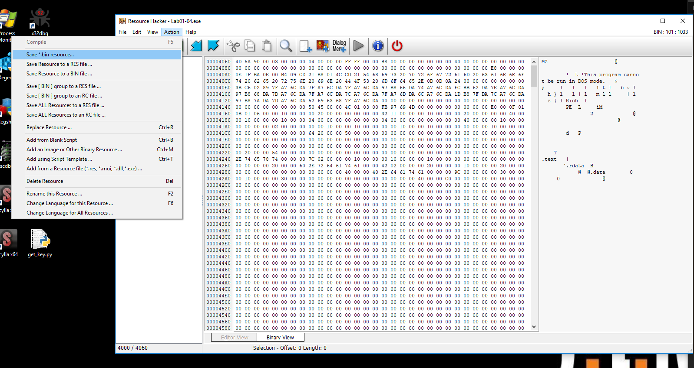

This post is part of the series of [Practical Malware Analysis Exercises.](../index.md)

## 1) VirusTotal Detections?

59/70 engines detected

## 2) Packed/Obfuscated?

It does not appear to be packed/obfuscated

## 3) Compile Date?

2019-08-30 22:26:59 

*Though the above is reasonable now, this date is the "future" when the book was written*

## 4) Import Hints?

- LookupPrivilegeValueA
- AdjustTokenPrivileges
- WinExec

	- **Execute commands and possible privilege escalation**

- CreateRemoteThread
- GetCurrentProcess
- OpenProcess
- OpenProcessToken
- GetProcAddress

	- **Possible code injection**

- LoadLibraryA
- GetModuleHandleA
- GetWindowsDirectoryA
- SizeofResource
- FindResourceA
- LoadResource

	- **Possibly loading payloads from a resource**

- WriteFile
- CreateFileA
- GetTempPathA
- MoveFileA

	- **dropping a file to the disk**

## 5) Host/Network Based Indicators?

## Host based

- *\system32\wupdmgr.exe*	
- *\winup.exe*
- *\system32\wupdmgrd.exe*
- *sfc_os.dll*

## Network based

- *hxxp://www[.]practicalmalwareanalysis[.]com/updater[.]exe*

## 6) Resources?

## Extracting resource

- Open original file in ResourceHacker and then extract it from the menu to a new file, and analyze that.

- The resource was an PE based on it's "MZ" header
- VT hit 56/71 engines

**Imports**

- GetWindowsDirectoryA
- GetTempPathA
- URLDownloadToFileA
	
	- *These indicate it will reach out and download/drop something to the target*
	

**Interesting strings**

- *hxxp://www[.]practicalmalwareanalysis[.]com/updater[.]exe*
- *\winup.exe*
- *\system32\wupdmgrd.exe*

## Overall Opinions

- This malware seems to load a secondary executable from it's resource section that will reach out to the internet and drop a third binary to the target's disk.
- It also will either inject code into it's own process or another programs process, probably loading the third binary into it